# Application Convergence and Consolidation Framework

Sep 23, 2026 · Adam Z. Stavely

## 1. Purpose and scope

This framework gives the organization one vocabulary and one repeatable process for reducing application sprawl by designing around user workflows, not around the applications we happen to have. Leadership has asked us to consolidate apps and streamline the user experience; this document defines what that means and how we will do it.

**In scope:** every user-facing application in the converged organization's portfolio, the workflows those applications support, and the capabilities and data behind them.

**Out of scope:** infrastructure consolidation that has no user-facing effect, vendor contract rationalization, and headcount decisions. These may follow from this work but are governed elsewhere.

**How to use it:** Section 3 is the shared lexicon every team should use in plans, briefings, and tickets. Sections 6 through 12 define the process, with flows, inputs, outputs, and exit criteria for each phase. Section 13 lists the artifacts each phase produces.

The central premise is simple. Users do not experience applications; they experience work. Every decision in this framework starts from a workflow and asks which applications, capabilities, and seams stand between the user and the outcome.

## 2. Guiding principles

Eight principles govern every decision in this framework. When a proposal conflicts with one, the conflict must be named and resolved at the governance board, not absorbed quietly by a team.

1. **Workflows first, applications second.** The unit of analysis is the end-to-end workflow. Applications are evaluated by how well they serve workflows, never the reverse.
2. **Evidence over opinion.** Dispositions rest on UX research, usage data, and capability mapping. Ownership, tenure, and sunk cost are context, not evidence.
3. **Converge behind the glass before consolidating in front of it.** Shared capabilities and data come before merged user interfaces. Consolidating without converging produces a larger monolith.
4. **Choose the lightest intervention that solves the problem.** Standardize before integrating, integrate before federating, and federate before consolidating, unless evidence shows the lighter option will not remove the friction.
5. **Better than parity.** A consolidated experience must match what users relied on and remove at least one measurable source of friction. Parity alone does not justify the disruption.
6. **Retirement is part of the plan.** No consolidation is complete until the source applications are turned off. Every consolidation carries its own exit criteria.
7. **No surprises.** Affected users and owning teams hear about a disposition from us, early, and before it appears in a roadmap.
8. **Measure the user outcome.** Success is time on task, handoffs removed, and error rates, not the count of applications alone.

## 3. Common lexicon

The core terms form a spectrum ordered by how much each intervention changes, from lightest to heaviest. Teams should name the specific intervention they mean rather than using "consolidation" as a catch-all.

### 3.1 The intervention spectrum

| Term | Definition | What the user sees | App count changes? | Example |
| --- | --- | --- | --- | --- |
| Standardization | Applications stay separate but adopt shared design tokens, components, and interaction patterns. | Apps look and behave alike. | No | All apps adopt the design system's table and form patterns. |
| Integration | Applications stay separate but exchange data and context through SSO, APIs, shared identifiers, and deep links. | No re-keying; handoffs carry context. | No | Selecting a record in App A opens it in App B, already loaded. |
| Federation | Applications keep independent ownership and deployment but render as modules inside a shared shell. | One entry point, one navigation, several modules. | Front ends: effectively yes. Codebases: no. | Three tools appear as tabs inside a SuperApp shell. |
| Convergence | Multiple applications move over time toward shared capability platforms, data, and components; duplicate logic migrates out of individual apps. | Gradual consistency; often invisible. | Not directly | Four apps stop maintaining their own notification logic and call one notification platform. |
| Consolidation | The functionality of several user-facing applications is merged into one destination, and the sources are retired. | Fewer apps; one place to do the work. | Yes | Two scheduling tools are replaced by one workflow in the SuperApp. |
| Retirement | An application is turned off, with its data migrated, archived, or disposed of under records rules. | The app is gone; a redirect points users to its replacement. | Yes | The legacy tool is decommissioned after cutover. |

**The key distinction:** convergence happens behind the glass and consolidation happens in front of it. Convergence is a direction of travel; consolidation is an end state, usually reached through convergence.

### 3.2 Supporting terms

| Term | Definition |
| --- | --- |
| Workflow | An end-to-end sequence a user performs to reach an outcome, independent of which applications it touches. The primary unit of analysis. |
| Task | A discrete step within a workflow, performed by one role toward one sub-goal. |
| Job to be done | The outcome a user is trying to achieve, stated without reference to any tool. |
| Persona or user population | A group of users who share goals, context, and workflows. |
| Capability | Something the organization does, such as "manage requirements" or "schedule resources", independent of any implementation. |
| Feature | A specific implementation of part of a capability inside an application. |
| Capability platform | A productized service that owns one capability for the whole organization and exposes it through APIs. |
| SuperApp | A consolidated, workflow-centered front end that composes capability platforms for a defined user population. |
| Seam | A point where a workflow crosses an application boundary. Seams concentrate friction, errors, and handoff cost. |
| Swivel-chair | Manual transfer of information between applications by the user, such as copying, re-keying, or cross-checking. |
| Overlap | Two or more applications implementing the same capability for the same or similar users. |
| Candidate | An application, capability, or workflow flagged for possible intervention during Identification. |
| Disposition | The decision assigned to each application or capability (see Section 4). |
| Wave | A bounded set of dispositions executed together because they share users, data, or dependencies. |
| Parity baseline | The documented list of tasks and behaviors a retiring application supports that its replacement must cover. |
| Cutover | The moment users are moved from a source application to its replacement. |
| System of record | The single authoritative source for a given data entity after convergence. |
| Exit criteria | The measurable conditions that must be true before a phase ends or an application is retired. |

## 4. Disposition model

Every application in the portfolio receives exactly one disposition, and every capability inside a candidate application receives its own. Dispositions are proposed by the working team and approved by the governance board (Section 5).

| Disposition | Meaning | Typical trigger |
| --- | --- | --- |
| Retain | Keep as is; apply standardization only. | Unique capability, healthy tech, low workflow friction. |
| Invest | Keep and grow; may become a consolidation destination or capability platform. | Strong fit, broad use, sound architecture. |
| Integrate | Keep separate; remove seams through data and context exchange. | Distinct capability but high handoff friction with neighbors. |
| Federate | Keep ownership; surface as a module inside a SuperApp shell. | Serves a SuperApp's users but not yet ready to be rebuilt. |
| Converge | Move shared logic and data into capability platforms. | Duplicated capability across apps; backend overlap. |
| Consolidate | Merge into a destination experience and schedule retirement. | Same users, same workflows, overlapping capabilities. |
| Retire | Turn off without replacement, or after cutover. | Low use, capability no longer needed, or replaced. |

### 4.1 Disposition decision tree

Apply the tree to each candidate application. It encodes the lightest-intervention principle: a heavier disposition is chosen only when a lighter one fails to remove the friction.

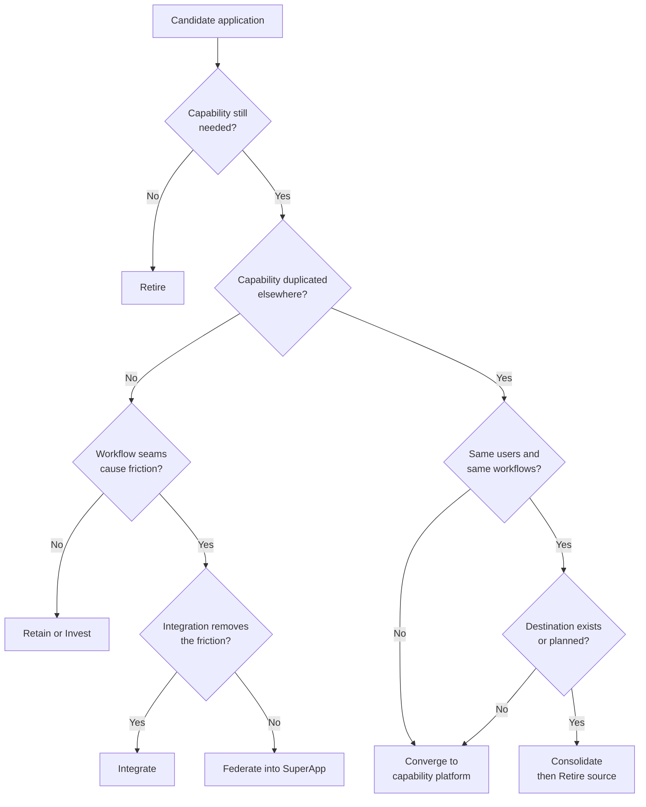

Read top to bottom: need, then duplication, then friction. Converge is the default for duplicated capabilities until a consolidation destination exists.

### 4.2 Scoring for prioritization

Once dispositions are proposed, candidates are scored to sequence the work. Each factor is scored 1 to 5 and weighted.

| Factor | Weight | 1 means | 5 means |
| --- | --- | --- | --- |
| User pain | 30% | Rarely reported, low task cost | Frequent, severe, measured friction |
| Overlap | 20% | Unique capability | Three or more apps duplicate it |
| Cost to run | 15% | Low license and ops cost | High cost relative to use |
| Technical health | 15% | Modern, supported | End-of-life dependencies, fragile |
| Strategic fit | 20% | Outside MACH target state | Directly enables a capability platform or SuperApp |

Weights are a starting proposal and should be ratified by the governance board at Charter.

## 5. Governance and decision rights

A single governance board owns disposition approval; the proposal is to charter this as a standing agenda item of the existing architecture review board (AERB) rather than create a new body. A Convergence Working Group, led jointly by UX and architecture, does the work between board decisions.

### 5.1 Roles

| Role | Responsibility |
| --- | --- |
| Executive sponsor | Sets targets, resolves cross-portfolio conflicts, owns the outcome to leadership. |
| Governance board (AERB) | Approves charter, dispositions, waves, and retirements. Arbitrates escalations. |
| Convergence lead | Runs the process end to end; owns the portfolio view and the roadmap. |
| UX research lead | Owns workflow discovery, journey maps, service blueprints, and user validation. |
| UX design lead | Owns target-state workflow design and SuperApp patterns. |
| Enterprise architect | Owns capability map, decomposition, and alignment with the MACH target architecture. |
| Application owner | Supplies inventory data, proposes dispositions for their app, executes migration. |
| Capability platform owner | Receives converged capabilities; owns APIs and service levels. |
| Change and communications lead | Owns the communication track, training, and adoption. |
| Records and security | Approves data disposition, access, and authority-to-operate impacts. |

### 5.2 RACI by phase

R = responsible, A = accountable, C = consulted, I = informed.

| Phase | Sponsor | Board | Conv. lead | UX research | UX design | Architect | App owner | Platform owner | Change lead |
| --- | --- | --- | --- | --- | --- | --- | --- | --- | --- |
| 0 Charter | A | R | R | C | C | C | I | I | C |
| 1 Discovery | I | I | A | R | C | R | R | C | I |
| 2 Identification | I | I | A | R | C | R | C | C | I |
| 3 Decomposition | I | I | A | C | C | R | R | C | I |
| 4 Disposition | C | A | R | C | C | R | C | C | C |
| 5 Target-state design | I | C | A | R | R | R | C | C | C |
| 6 Coordination | I | C | A | C | C | R | R | R | R |
| 7 Migration | I | I | A | C | C | C | R | R | R |
| 8 Retirement | I | A | R | I | I | C | R | C | R |
| 9 Measurement | I | I | A | R | C | C | C | C | R |

### 5.3 Escalation path

Disagreements go from the working group to the convergence lead within five business days, then to the board at its next session, then to the executive sponsor. An application owner may always appeal a Consolidate or Retire disposition once, with evidence.

## 6. End-to-end process

The process runs in ten phases grouped into four stages: Understand, Decide, Deliver, and Sustain. Charter runs once; phases 1 through 9 repeat per wave, and communication runs in parallel throughout.

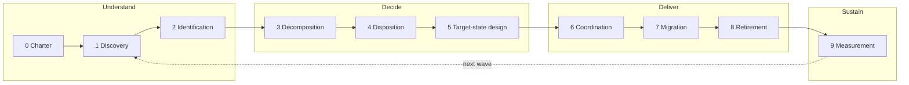

Each arrow is a gate: a phase ends only when its exit criteria are met and, where marked, the board has approved. Measurement feeds the next wave's Discovery.

### 6.1 Phase summary

| Phase | Key question | Primary outputs | Gate |
| --- | --- | --- | --- |
| 0 Charter | What are we authorized to do, and how will we decide? | Charter, principles, scoring weights, decision rights | Board approval |
| 1 Discovery | What exists, who uses it, and how does work actually flow? | Application census, workflow catalog, journey maps, service blueprints | Coverage threshold met |
| 2 Identification | Where are the seams and overlaps? | Workflow-by-app matrix, capability heat map, candidate list | Candidates reviewed |
| 3 Decomposition | What are candidates made of? | Capability, feature, data, and integration breakdowns; parity baselines | Decomposition complete per candidate |
| 4 Disposition | What happens to each app and capability? | Approved dispositions, scores, waves | Board approval |
| 5 Target-state design | What should the work look like? | Target workflows, prototypes, validated designs | Usability targets met |
| 6 Coordination | Who does what, when, in what order? | Roadmap, dependency map, team assignments | Wave plan approved |
| 7 Migration | How do we move users and data safely? | Migrated capabilities, cutovers, parity sign-off | Cutover criteria met |
| 8 Retirement | Is it really off? | Decommission record, archived data | Board approval |
| 9 Measurement | Did the user outcome improve? | Outcome report, lessons, next-wave inputs | Report published |

## 7. Phases 0 and 1: Charter and Discovery

### 7.1 Phase 0: Charter

Charter establishes authority before analysis begins, so later dispositions cannot be dismissed as unauthorized.

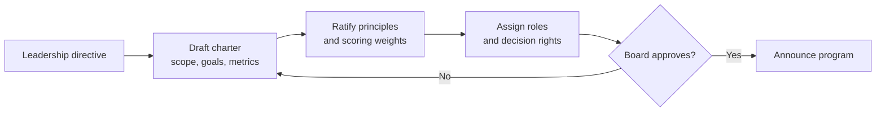

The announcement is the first communication-track event (Section 11).

| Inputs | Activities | Outputs | Exit criteria |
| --- | --- | --- | --- |
| Leadership directive, portfolio list, MACH target architecture | Define scope and targets; ratify principles and weights; name roles; set cadence | Signed charter, RACI, scoring model, meeting cadence | Board approval; sponsor named; all roles staffed |

### 7.2 Phase 1: Discovery

Discovery runs two tracks in parallel: a portfolio track that describes the applications, and a research track that describes the work. The tracks join in a workflow catalog.

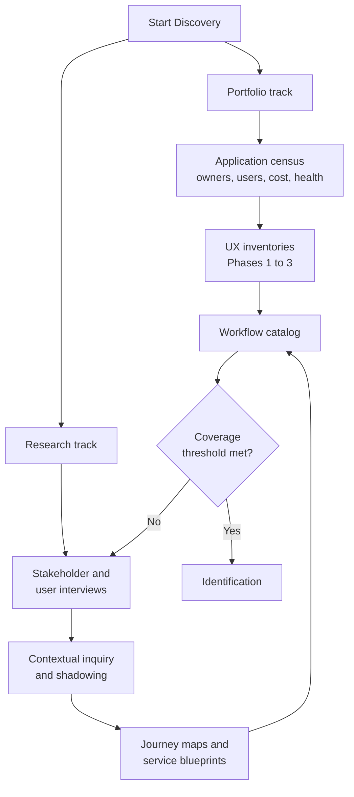

The portfolio track reuses the existing UX standardization inventories rather than starting a new data call.

**Portfolio track: application census fields.** Application name and owner; user populations and counts; monthly active users; business capabilities supported; data entities owned and consumed; integrations; hosting and tech stack; lifecycle and end-of-life dependencies; annual run cost; adoption of the central CI/CD and developer platform; roadmap URL.

**Research track: methods.** Stakeholder interviews for intent and constraints; contextual inquiry and shadowing for how work actually happens; diary studies for long-running workflows; analytics and log review to validate what users report; journey maps per persona; service blueprints for workflows that cross three or more applications.

| Inputs | Activities | Outputs | Exit criteria |
| --- | --- | --- | --- |
| Charter, existing inventories, analytics | Census data call; research plan; interviews; observation; mapping | Application census, workflow catalog, persona set, journey maps, service blueprints | Census complete for 100% of in-scope apps; research covers the workflows of at least 80% of users by population |

## 8. Phases 2 and 3: Identification and Decomposition

### 8.1 Phase 2: Identification

Identification turns Discovery data into a ranked candidate list using two matrices. Where high seam density and high overlap coincide, the candidate is strongest.

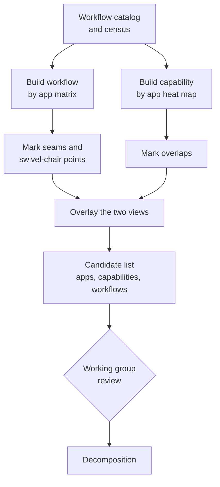

**Matrix A: workflow by application.** Rows are workflows; columns are applications. Each cell records whether the workflow touches the app, and the seam type at each crossing: none, integrated handoff, manual handoff, or re-keying. Rows with many manual crossings are high-friction workflows.

| Workflow | App A | App B | App C | App D | Seams | Manual seams |
| --- | --- | --- | --- | --- | --- | --- |
| Example: onboard a new analyst | Start | Re-key | Manual | Integrated | 3 | 2 |

**Matrix B: capability by application.** Rows are capabilities from the capability map; columns are applications. Each cell rates how fully the app implements the capability (none, partial, full). Rows with two or more partial or full cells are overlaps.

| Capability | App A | App B | App C | App D | Implementations |
| --- | --- | --- | --- | --- | --- |
| Example: notifications | Full | Partial | Full | None | 3 |

| Inputs | Activities | Outputs | Exit criteria |
| --- | --- | --- | --- |
| Census, workflow catalog, capability map | Build matrices; quantify seams and overlaps; review with owners | Matrices A and B, candidate list with rationale | Every candidate has evidence from both matrices or research; owners have reviewed |

### 8.2 Phase 3: Decomposition

Decomposition breaks each candidate into parts small enough to assign a disposition to each part. Applications are rarely all one thing; one app may hold a capability worth converging and another worth retiring.

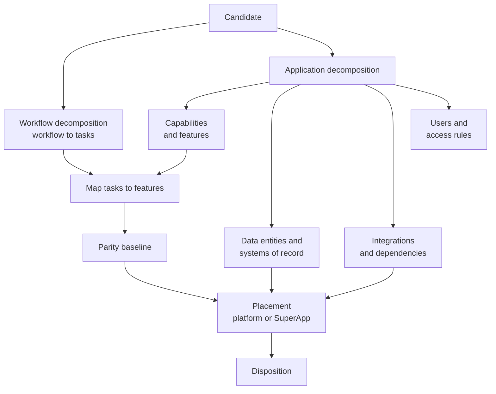

The placement step asks one question per part: does it belong in a capability platform (shared logic, data, rules) or in a SuperApp experience (workflow-specific presentation and orchestration)?

| Inputs | Activities | Outputs | Exit criteria |
| --- | --- | --- | --- |
| Candidate list, research artifacts, architecture docs | Task analysis; feature inventory; data lineage; dependency mapping; access review | Decomposition record per candidate; parity baseline; placement proposal | Every feature mapped to a task or flagged unused; every data entity has a proposed system of record |

## 9. Phases 4 and 5: Disposition and Target-state design

### 9.1 Phase 4: Disposition and prioritization

Disposition converts decomposition records into board-approved decisions and groups them into waves. It is the only phase where applications formally change status.

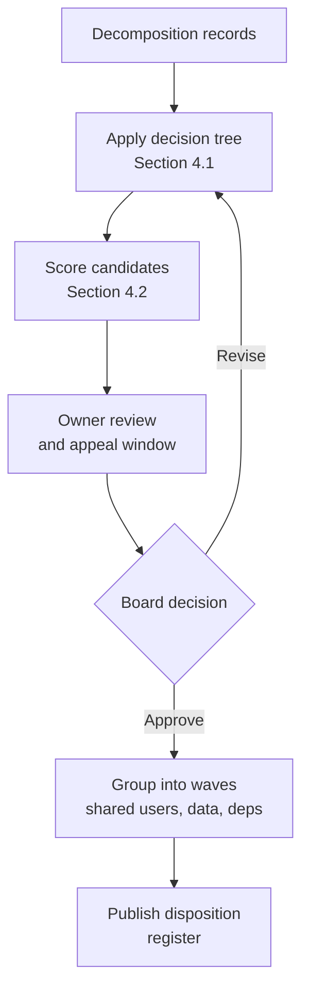

Waves group dispositions that share users, data, or dependencies, so each population experiences one coordinated change instead of several scattered ones.

| Inputs | Activities | Outputs | Exit criteria |
| --- | --- | --- | --- |
| Decomposition records, scoring model | Apply tree; score; hold owner reviews; brief board | Disposition register; prioritized backlog; wave definitions | Board approval; owners notified before publication; appeals resolved |

### 9.2 Phase 5: Target-state design

Target-state design defines how each affected workflow should work after the intervention, and proves it with users before engineering commits.

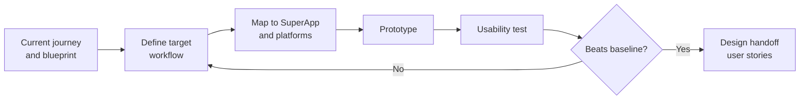

**Design standards.** Target designs use the enterprise design system and the patterns from the UX standardization effort. Each target workflow names the SuperApp it lives in, the capability platforms it calls, and the seams it removes.

**Validation bar.** A target design passes when, against the current-state baseline, it covers every item in the parity baseline and shows measured improvement on at least one of: time on task, number of seams, error rate, or satisfaction score.

| Inputs | Activities | Outputs | Exit criteria |
| --- | --- | --- | --- |
| Approved dispositions, journeys, parity baselines | Workflow redesign; information architecture; prototyping; usability testing | Target journey maps; validated prototypes; user stories; API needs for platforms | Parity covered; improvement demonstrated; handoff accepted by delivery teams |

## 10. Phases 6 to 8: Coordination, Migration, and Retirement

### 10.1 Phase 6: Coordination

Coordination turns approved designs into a sequenced, owned plan across many teams. Ownership follows the target architecture: stream-aligned teams own SuperApp experiences, and platform teams own capability platforms.

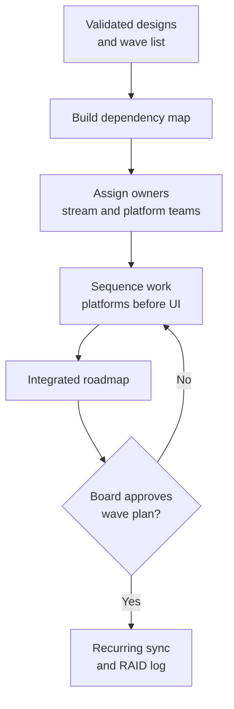

**Operating cadence.** A weekly cross-team convergence sync reviews dependencies, blockers, and the risks, assumptions, issues, and decisions (RAID) log. A monthly board checkpoint reviews wave status and approves changes to scope or sequence.

| Inputs | Activities | Outputs | Exit criteria |
| --- | --- | --- | --- |
| Disposition register, user stories, platform API needs | Dependency mapping; team assignment; sequencing; capacity check | Integrated roadmap; dependency map; RAID log; team assignments | Every item has an owner and date; no unowned dependency; board approval |

### 10.2 Phase 7: Migration

Migration moves capabilities, data, and users incrementally. The default pattern is strangler fig: new capability routes grow around the old application until nothing is left inside it.

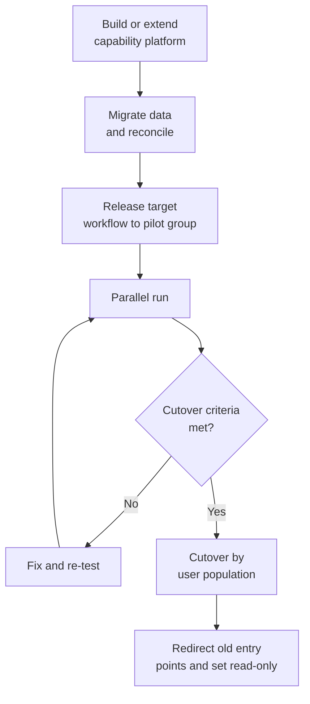

**Cutover criteria.** Parity baseline signed off by the product owner and a user representative; data reconciled with zero unresolved critical discrepancies; pilot group task success at or above baseline; support and training in place; rollback plan tested.

| Inputs | Activities | Outputs | Exit criteria |
| --- | --- | --- | --- |
| Roadmap, designs, platform APIs | Build; data migration; pilot; parallel run; cutover; redirects | Live target workflow; reconciled data; source set read-only | Cutover criteria met for every affected user population |

### 10.3 Phase 8: Retirement

Retirement proves the source application is truly gone and its data is properly handled. Without this phase, consolidation adds an application instead of removing one.

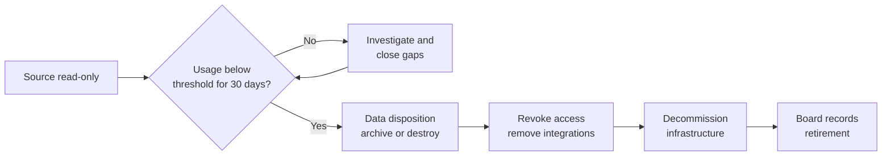

| Inputs | Activities | Outputs | Exit criteria |
| --- | --- | --- | --- |
| Read-only source, usage telemetry, records schedule | Monitor usage; close stragglers; archive data; revoke access; decommission | Decommission record; archive location; cost savings recorded | Zero active users; data dispositioned per records rules; infrastructure removed; board recorded |

## 11. Communication and change management track

Communication runs alongside every phase rather than as a phase of its own. Its job is to make sure no team or user learns about a change affecting them from a roadmap slide or a shutdown notice.

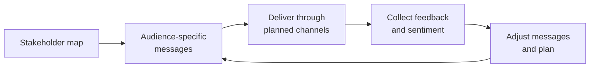

The loop repeats at every phase gate and every wave.

### 11.1 Audiences

| Audience | What they need to know | Primary channel |
| --- | --- | --- |
| Leadership | Progress against targets, risks, decisions needed | Monthly board brief; quarterly report |
| Application owners and teams | Dispositions affecting them, rationale, appeal path, their role | Direct engagement before publication; working group |
| Capability platform teams | Incoming capabilities, API needs, timelines | Coordination sync; roadmap |
| End users | What changes, when, why it is better, where to get help | In-app banners; email; champions; training |
| Support desk | Cutover dates, known issues, redirect paths | Runbooks; pre-cutover briefings |

### 11.2 Communication events by phase

| Phase | Event |
| --- | --- |
| 0 Charter | Program announcement: why, goals, principles, how decisions are made |
| 1 Discovery | Research recruitment; data-call notice to owners; "you said, we heard" summaries |
| 2 Identification | Candidate list previewed privately with affected owners |
| 4 Disposition | Owners briefed individually before publication; register published with rationale |
| 5 Design | Users invited to test prototypes; champions recruited |
| 7 Migration | Cutover notices at 30, 14, and 3 days; training; in-app guidance; office hours |
| 8 Retirement | Final notice; redirect live; closure message recognizing the retiring team's work |
| 9 Measurement | Outcome report shared with users and leadership |

### 11.3 Managing resistance

The strongest resistance usually comes from teams whose applications are being retired. Engage them early, show the evidence, give them a real role in the destination (often as a stream-aligned or platform team), and publicly credit the work their application did. An appeal path that is actually used, and occasionally succeeds, builds more trust than one that exists only on paper.

## 12. Phase 9: Measurement and success metrics

Success is measured primarily by user outcomes, with portfolio and cost measures as supporting evidence. Baselines are captured in Discovery and Target-state design so every wave can report change, not just status.

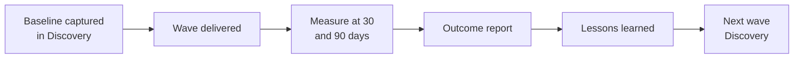

| Category | Metric | How measured |
| --- | --- | --- |
| User outcome | Time on task for priority workflows | Usability benchmarks; analytics |
| User outcome | Seams per workflow, and manual seams per workflow | Matrix A, before and after |
| User outcome | Task success and error rate | Usability testing; support tickets |
| User outcome | Satisfaction (SUS or similar) | Survey per persona |
| Adoption | Active users on target workflows vs. source apps | Telemetry |
| Portfolio | Number of user-facing applications | Census |
| Portfolio | Duplicate capability implementations | Matrix B, before and after |
| Cost | Run cost retired | Decommission records |
| Delivery | Waves completed on plan; median time from disposition to retirement | Roadmap tracking |

Portfolio metrics must never be reported without user outcome metrics alongside them. A lower app count paired with worse task times is a failure.

## 13. Artifacts catalog

Each artifact has one owner and one home, so teams know where the current version lives.

| Artifact | Produced in | Owner | Purpose |
| --- | --- | --- | --- |
| Program charter | 0 Charter | Convergence lead | Scope, goals, principles, decision rights |
| Scoring model | 0 Charter | Convergence lead | Weighted prioritization factors |
| Application census | 1 Discovery | Enterprise architect | Single portfolio view of every in-scope app |
| Workflow catalog | 1 Discovery | UX research lead | Named workflows per persona, with frequency and criticality |
| Journey maps and service blueprints | 1 Discovery | UX research lead | Current-state experience across apps |
| Capability map | 1 Discovery | Enterprise architect | Implementation-independent list of what the organization does |
| Matrix A: workflow by app | 2 Identification | UX research lead | Seam and swivel-chair analysis |
| Matrix B: capability by app | 2 Identification | Enterprise architect | Overlap analysis |
| Candidate list | 2 Identification | Convergence lead | Flagged apps, capabilities, and workflows with evidence |
| Decomposition record | 3 Decomposition | Enterprise architect | Parts, data, dependencies, and placement per candidate |
| Parity baseline | 3 Decomposition | App owner | What the replacement must cover |
| Disposition register | 4 Disposition | Convergence lead | Approved dispositions, scores, and waves |
| Target journey maps and prototypes | 5 Design | UX design lead | Validated future-state workflows |
| User stories | 5 Design | UX design lead | Design handoff to delivery teams |
| Integrated roadmap and dependency map | 6 Coordination | Convergence lead | Sequenced, owned plan |
| RAID log | 6 Coordination | Convergence lead | Risks, assumptions, issues, decisions |
| Cutover checklist | 7 Migration | App owner | Evidence that cutover criteria are met |
| Decommission record | 8 Retirement | App owner | Proof of retirement and data disposition |
| Outcome report | 9 Measurement | Convergence lead | Before-and-after results per wave |
| Stakeholder map and comms plan | All phases | Change lead | Audiences, messages, channels, timing |

## 14. Alignment and open questions

This framework is the user-experience half of the move to a MACH architecture. The target structure of capability platforms, an AI orchestration layer, and a small number of SuperApps is the destination; this process decides which applications and capabilities go where, and in what order.

| Related effort | How this framework connects |
| --- | --- |
| MACH architecture program | Supplies the target state; Converge dispositions feed capability platforms and Consolidate dispositions feed SuperApps. Foundation work planned for Oct to Dec 2026 is a natural window for Charter and Discovery. |
| UX standardization (inventory Phases 1 to 3) | Supplies Discovery's UX data; Standardize is the lightest disposition and applies to every retained app. |
| Central CI/CD and developer platform onboarding | Onboarding status is a census field and a technical-health scoring input. |
| Architecture review board | Proposed home for disposition approval. |

### 14.1 Open questions

- [ ] Does the architecture review board take on disposition approval, or do we charter a separate board?
- [ ] Who is the executive sponsor?
- [ ] Are the proposed scoring weights in Section 4.2 acceptable to leadership?
- [ ] What is the leadership target for application count, and should it be paired with a user-outcome target?
- [ ] Which user population and workflows go in the first wave?
- [ ] What records and authority-to-operate constraints apply to data disposition and decommissioning?
